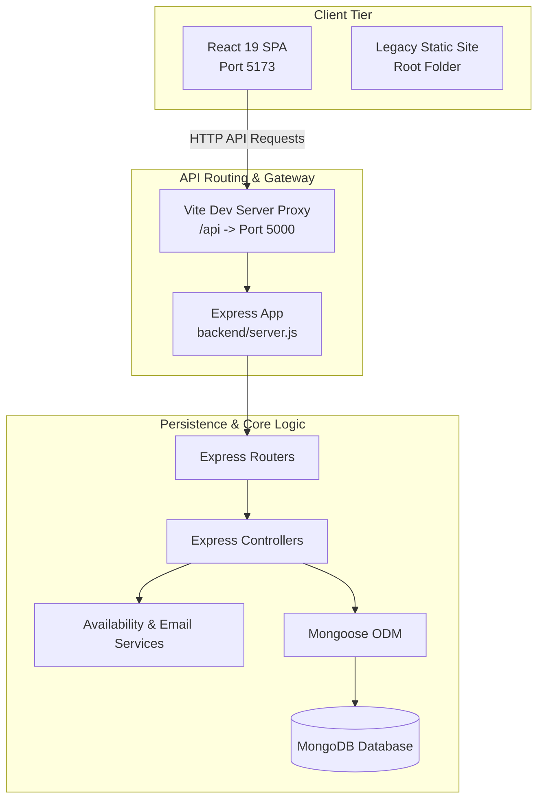
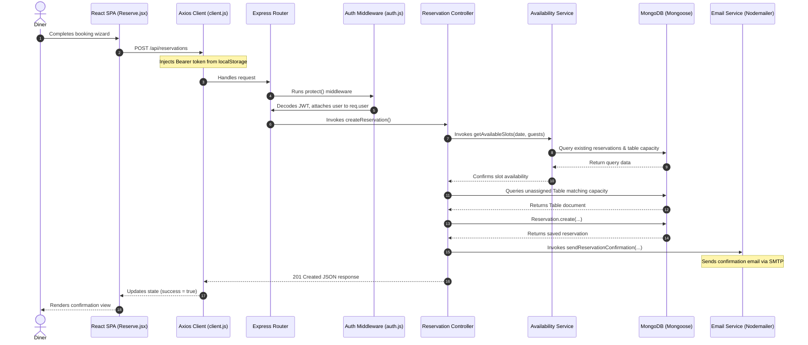
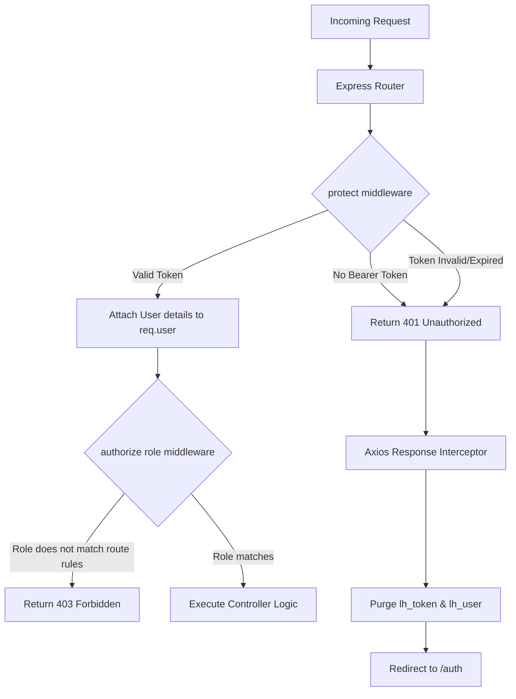

# System Architecture: The Lighthouse

This document details the software architecture of **The Lighthouse** restaurant application. It provides design patterns, data flows, and configuration rules for maintainers and contributors.

---

## 1. System Overview

The Lighthouse is a full-stack restaurant reservation and menu management application. Its primary feature is a live menu availability engine that resolves the problem of static dining menus (where guests book tables without knowing daily menu adjustments or sold-out items).

### Subsystems & Coexistence
The codebase contains two parallel systems:
1. **Active Full-Stack Application:** A decoupled MERN (MongoDB, Express, React, Node.js) system divided into:

   - **`/frontend`:** A single-page application (SPA) built using React 19 and Vite.

   - **`/backend`:** A REST API built with Express.js and Node.js using Mongoose to interface with MongoDB.

2. **Legacy Static Client (Root Folder):** A self-contained frontend (`index.html`, `script.js`, `style.css`) using mock data, local translation files (`/locales`), and `localStorage`. It does not connect to the Express API.

### Subsystem Interaction


---

## 2. Directory Structure

The repository is organized as follows:

```text
The-Lighthouse/
├── backend/                  # Express REST API
│   ├── src/
│   │   ├── config/           # DB connection and seed scripts
│   │   ├── controllers/      # Route request/response handlers
│   │   ├── middleware/       # JWT checks, input validation, rate limiting
│   │   ├── models/           # Mongoose schemas
│   │   ├── routes/           # Express router configs
│   │   └── services/         # Isolated core business logic
│   ├── server.js             # API entry point
│   └── package.json          # Node server configurations
│
├── frontend/                 # React 19 + Vite client
│   ├── src/
│   │   ├── api/              # Axios instance and API request functions
│   │   ├── assets/           # Client-side media assets
│   │   ├── components/       # UI components and route guards
│   │   ├── context/          # React Context providers (global state)
│   │   ├── pages/            # Page-level route views
│   │   ├── App.jsx           # Client router and provider nesting
│   │   └── main.jsx          # React app mount entry point
│   ├── index.html            # Vite HTML template
│   └── package.json          # React dependencies
│
├── locales/                  # Legacy translations (consumed only by legacy client)
├── images/                   # Shared image resources
├── index.html                # Legacy landing page (do not modify)
├── script.js                 # Legacy client logic (do not modify)
├── style.css                 # Legacy client stylesheet (do not modify)
└── Readme.md                 # Main repo description
```

### Responsibility Breakdown
- [backend/server.js](./backend/server.js) initializes the Express application, configures global middlewares (Helmet, CORS, body parsing), establishes the MongoDB connection, and registers core API routes.

- The [backend/src/services/](./backend/src/services) directory encapsulates operations that are too complex to live inside controllers. For example, [availabilityService.js](./backend/src/services/availabilityService.js) generates 30-minute reservation windows, filters out dates in the past, verifies party size bounds against table capabilities, and checks table capacity availability.

- The [frontend/src/api/client.js](./frontend/src/api/client.js) manages Axios configurations. It injects active JWT headers into outgoing requests and intercepts 401 errors to trigger session purge and login redirects.

---

## 3. Core Request Lifecycle & Data Flow

### A. Reservation Execution Flow
When a user books a table via the 4-step reservation wizard (`Reserve.jsx`), the request processes through these layers:



### B. Global Error Handling
- **Backend:** Errors thrown during request executions are captured by the error-handling middleware registered in [backend/server.js](./backend/server.js#L57-L63). It logs stack traces and returns a structured JSON payload:
  ```json
  {
    "success": false,
    "error": "Something went wrong!"
  }
  ```

- **Frontend:** API requests verify results using try-catch blocks. Caught exceptions update the page’s local `error` state and render warning dialogs inline.

---

## 4. Layer Responsibilities & Boundaries

### Presentation / UI Layer (`/frontend/src/pages` & `/frontend/src/components`)

- Implements visual widgets, page-level route templates, and form bindings.

- Communicates exclusively with backend API services through Axios and React contexts. No direct database or route orchestrating logic.

### Client API & Context Tier (`/frontend/src/api` & `/frontend/src/context`)

- Configures Axios headers, intercepts response errors, and serializes server data.

- Exposes user authentication data (`AuthContext`) and menu records (`MenuContext`) to downstream UI components.

### Routing & Middleware Tier (`/backend/src/routes` & `/backend/src/middleware`)

- Declares endpoints, checks CORS origins, parses request payloads, rate-limits access, compiles authentication details, and asserts role authorizations.

### Controllers Tier (`/backend/src/controllers`)

- Extracts parameters, routes processing to helper services, calls database models, and generates HTTP response structures.

### Business Logic Service Tier (`/backend/src/services`)

- Houses isolated logic operations (such as generating time-slots or triggering SMTP mailings) that are detached from the Express request lifecycle.

### Data persistence Tier (`/backend/src/models`)

- Defines schemas, asserts validation boundaries, configures indexes, and hashes passwords using database schema lifecycle hooks.

---

## 5. State Management

The frontend React client manages state at three distinct boundaries:

1. **Global Context State (`/frontend/src/context`):**

   - **`AuthContext`:** Manages user profile details, loading state, signup, login, and updates to user dietary preferences. It automatically initializes using stored credentials on boot.

   - **`MenuContext`:** Stores and retrieves full menu records, loading flags, and network error statuses. It allows instant in-place updates when an admin toggles a dish's status.

2. **Local Component State (`useState`):**

   - Manages interactive states such as wizard step indexes, search inputs, custom modals, toggles, and form controls.

3. **Session Persistence Store (`localStorage`):**

   - `lh_token`: Secure JWT string passed with backend-bound requests.

   - `lh_user`: Cached JSON metadata of the authenticated user.

---

## 6. Authentication & Authorization Flow

The API routes are protected using JWT authorization tokens and role-gated middleware:



### Key Security Components

- **`protect` Middleware ([backend/src/middleware/auth.js](./backend/src/middleware/auth.js#L5)):** Extracts the bearer token, decrypts it using the server's secret, and queries the user profile. Passes execution forward only if the token matches a valid database user.

- **`authorize` Middleware ([backend/src/middleware/auth.js](./backend/src/middleware/auth.js#L26)):** Checks user role authorizations (e.g. `admin`, `staff`). Restricts endpoint execution if role privileges do not match criteria.

- **Frontend Guard (`ProtectedRoute.jsx`):** Renders children routes only if user profiles exist. Blocks dashboard rendering if admin access is required but profile role claims are insufficient.

- **Axios Token Interceptor ([frontend/src/api/client.js](./frontend/src/api/client.js#L15-L26)):** Evaluates server errors. On encountering `401 Unauthorized` responses, it clears client credentials from local storage and redirects the browser window to `/auth`.

---

## 7. Build, Development, & Seeding Setup

### Local Development Loop
- The Express server runs using `nodemon` on port `5000`.

- The React frontend runs on port `5173`.

- During development, Vite proxies requests starting with `/api` to the backend server ([frontend/vite.config.js](./frontend/vite.config.js#L8-L14)):
  ```javascript
  proxy: {
    '/api': {
      target: 'http://localhost:5000',
      changeOrigin: true
    }
  }
  ```

### Database Seeding
To reset the MongoDB state and load default collections, run:
```bash
cd backend
npm run seed
```
This executes [backend/src/config/seed.js](./backend/src/config/seed.js) to truncate the tables, reservation, and user collections, and insert:
- **18+ Menu Items:** Populated with dish names, pricing details, vegetarian/non-vegetarian booleans, categorization flags, and list arrays for allergens and tag descriptions.

- **9 Tables:** Divided into seating capacities of 2, 4, and 6 chairs.

- **Test Accounts:**
  - Admin: `admin@thelighthouse.com` (Password: `Admin@123`)
  - Guest: `test@example.com` (Password: `password123`)

---

## 8. Verification & CI/CD Architecture

### Testing Architecture

- **Automated Tests:** The project has **no active unit or integration tests**. While `jest` and `supertest` packages are declared in `backend/package.json`, they are not configured or utilized.

- **Verification Gaps:** There are no tests verifying API endpoints, React UI flows, database configurations, or email service tasks.

### CI/CD Workflow
The pipeline configured in [.github/workflows/sanity-checks.yml](./.github/workflows/sanity-checks.yml) checks syntax parsing exclusively for the root legacy files:
- Checks if the legacy root script `script.js` parses correctly.

- Confirms root `index.html` file completeness.

- Asserts format correctness of JSON files inside the `locales` folder.

- **Limitation:** Pull requests altering the active `/backend` or `/frontend` applications are not built, linted, or verified in the CI/CD pipeline.

---

## 9. Extension Guidelines

To maintain code quality and prevent architectural drift, contributors must follow these structural guidelines:

- **Adding UI Pages:** Define the component within `/frontend/src/pages` and register the route inside the router stack in [frontend/src/App.jsx](./frontend/src/App.jsx).

- **Adding REST Routes:** Define the routes in a dedicated route file within `/backend/src/routes` and mount it under a path prefix in [backend/server.js](./backend/server.js).

- **Processing Requests:** Put request-handling parameters and route controllers in `/backend/src/controllers`. Use middleware helper logic inside `/backend/src/middleware` to validate schemas before execution.

- **Isolating Logic:** Put complex business processes, time checks, or notification deliveries in a service class within `/backend/src/services` rather than directly in controllers.

- **Structuring Collections:** Create a new Mongoose schema in `/backend/src/models` and register indices for performance queries.

---

## 10. Architectural Constraints & Limitations

1. **Workspace Coexistence & Entry Clutter:**
   The workspace maintains the legacy static client files in the root ([index.html](./index.html), [script.js](./script.js), [style.css](./style.css)) in parallel with the active `/frontend` (Vite React SPA) and `/backend` (Express API) folders.

2. **Setup Documentation Inconsistencies:**
   The project's [CONTRIBUTING.md](./CONTRIBUTING.md) specifies configuration rules for the legacy static client (instructing contributors to open root files using VS Code Live Server) rather than the active MERN application setup instructions.
   
3. **CI/CD Build & Test Verification Gaps:**
   The automated pipeline configured in [.github/workflows/sanity-checks.yml](./.github/workflows/sanity-checks.yml) runs parsing verification tests only against the root legacy files, completely bypassing integration builds, linting, or testing validations for both the Express backend and React SPA.
