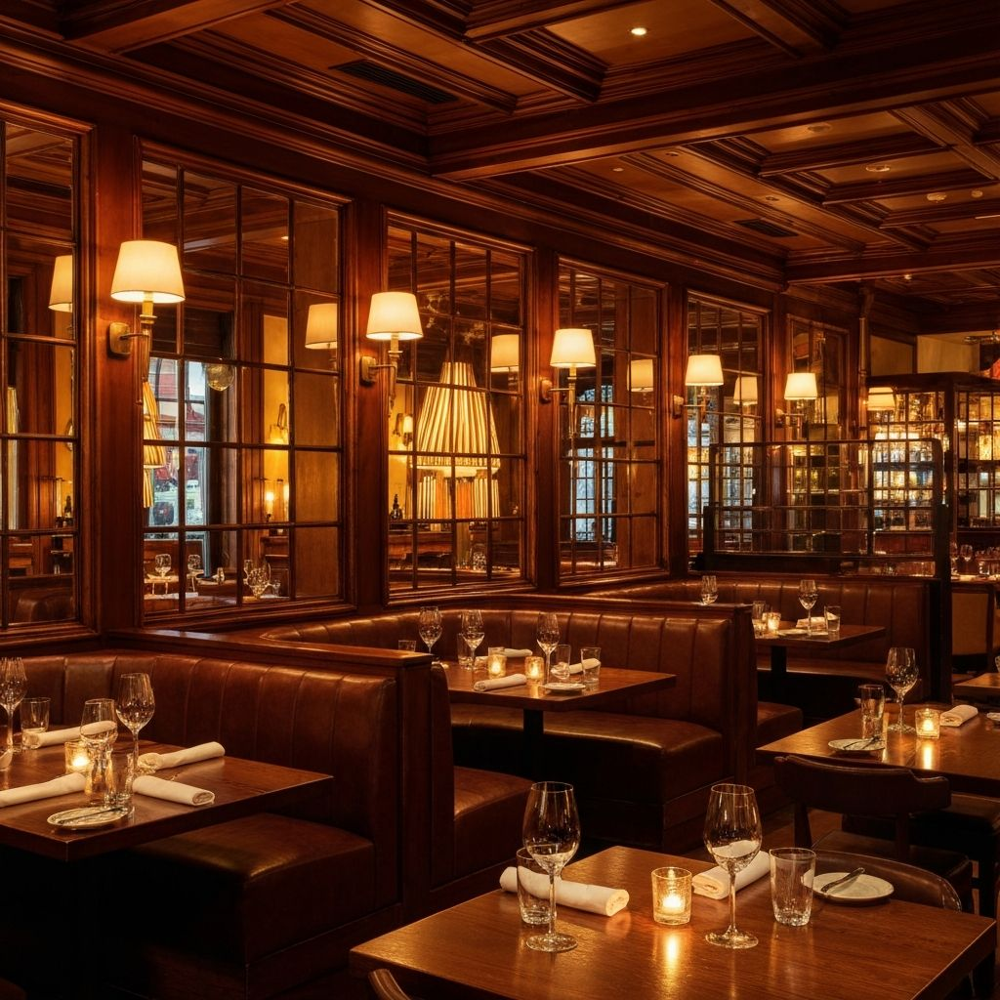
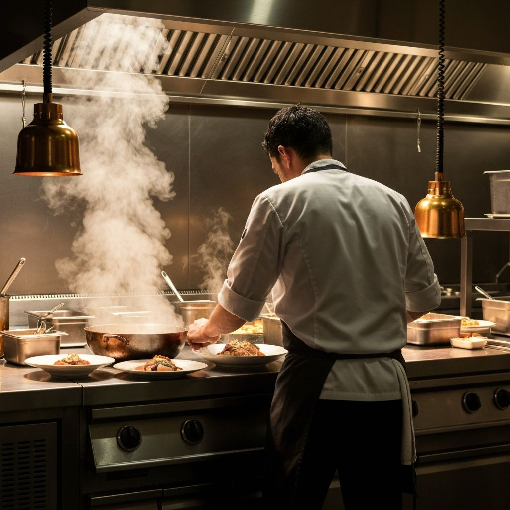
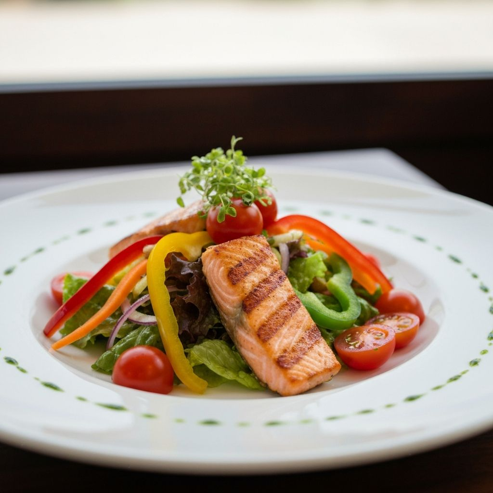
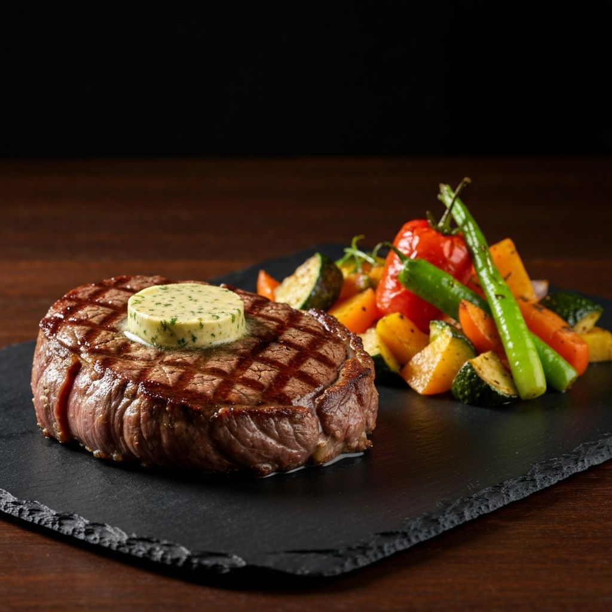

# 🌊 The Lighthouse | Fine Dining Restaurant Website

<div align="center">

A premium and fully responsive single-page restaurant website crafted for luxury fine-dining experiences.

Designed with elegant dark aesthetics, immersive visuals, smooth animations, and interactive UI elements to deliver a sophisticated digital presence for modern culinary brands.

🏆 Officially part of **GirlScript Summer of Code 2026 (GSSoC'26)**

</div>

---

# ✨ Features

## 🎨 Premium UI & Branding

- Elegant dark-themed luxury interface
- Gold-accented modern design
- Premium typography using:
  - **Cormorant Garamond**
  - **Inter**
- Smooth transitions and hover effects

---

## 📋 Dynamic Menu System

Interactive category-based menu tabs:

- 🍳 Breakfast
- 🥗 Lunch
- 🍽️ Dinner
- 🍸 Drinks

Switch seamlessly between menu sections without page reloads.

---

## 📱 Fully Responsive Design

- Mobile-first architecture
- Responsive layouts for all devices
- Hamburger navigation menu
- Optimized user experience across screen sizes

---

## ⚡ Smooth User Experience

### ✨ Advanced UI Interactions

- Sticky glassmorphism navbar
- Smooth scrolling navigation
- Scroll reveal animations
- Hover effects and transitions
- Parallax scrolling backgrounds

---

## 🗓️ Reservation System

- Interactive reservation form with live field validation
- **Node.js + Express backend** with REST API
- **SQLite database** (via sql.js — zero-config, no native compilation needed)
- Server-side validation: date must be future, guests 1–8, valid time slots
- Prevents past-date and past-time booking
- Success feedback with reservation ID confirmation

---

## 🔐 Admin Dashboard

- Session-based authentication with configurable credentials
- Premium dark/gold themed management interface at `/admin`
- View, confirm, cancel, and delete reservations
- Sortable table with status filters (All / Pending / Confirmed / Cancelled)
- Summary count cards and real-time search
- Confirmation dialogs and toast notifications

---

## 📍 Google Maps Integration

- Embedded Google Maps support
- Custom grayscale styling matching site aesthetics

---

# 📸 Website Assets

## 🏠 Hero Background



---

## 👨‍🍳 Chef Section



---

## 🍳 Breakfast Menu


---

## 🥗 Lunch Menu



---

## 🍽️ Dinner Menu



---

## 🍸 Drinks Menu


---

# 🛠️ Tech Stack

| Technology | Purpose |
|------------|----------|
| HTML5 | Semantic structure |
| CSS3 | Styling, layouts & animations |
| JavaScript (ES6+) | Frontend interactions |
| Node.js + Express | Backend server & REST API |
| SQLite (sql.js) | Reservation database (zero-config) |
| express-session | Admin session authentication |
| express-validator | Server-side input validation |
| Google Fonts | Premium typography |
| Intersection Observer API | Scroll animations |

---

# 📂 Project Structure

```bash
The-Lighthouse/
│
├── admin/
│   └── index.html          # Admin dashboard (login + reservation management)
│
├── db/
│   └── database.js         # SQLite database layer (sql.js / WASM)
│
├── images/                 # Menu item and hero images
│   ├── breakfast.jpg
│   ├── chef.jpg
│   ├── dinner.jpg
│   ├── drinks.jpg
│   ├── hero-restaurant.jpg
│   ├── lunch.jpg
│   └── ... (menu item images)
│
├── routes/
│   ├── admin.js            # Admin auth endpoints (login / logout)
│   └── reservations.js     # Reservation REST API (CRUD)
│
├── .gitignore              # Excludes node_modules, reservations.db, etc.
├── Favicon.ico
├── index.html              # Main restaurant website
├── LICENSE
├── package.json            # Node.js dependencies & scripts
├── Readme.md
├── robots.txt
├── script.js               # Frontend interactions (menu, forms, reviews)
├── server.js               # Express application server
├── sitemap.xml
└── style.css               # All styling, themes, responsive breakpoints
```

---

# 🚀 Getting Started

## 1️⃣ Clone the Repository

```bash
git clone https://github.com/Anushka-Sarkar/the-lighthouse-restaurant.git
```

---

## 2️⃣ Navigate to the Project Directory

```bash
cd the-lighthouse-restaurant
```

---

## 3️⃣ Install Dependencies

```bash
npm install
```

---

## 4️⃣ Start the Server

```bash
npm start
```

This will launch the server. You'll see:

```
  🌊  The Lighthouse — Reservation Server
  ─────────────────────────────────────────
  Site:   http://localhost:3000
  Admin:  http://localhost:3000/admin
  API:    http://localhost:3000/api/reservations
```

Open `http://localhost:3000` in your browser to view the full site.

> **Tip:** Use `npm run dev` during development — it auto-restarts the server on file changes.

---

## 5️⃣ Admin Dashboard

Navigate to `http://localhost:3000/admin` and log in with:

- **Username:** `admin`
- **Password:** `lighthouse2026`

To change credentials, set environment variables before starting:

```bash
# Linux / macOS
export ADMIN_USER="myuser"
export ADMIN_PASS="mysecretpassword"
npm start

# Windows PowerShell
$env:ADMIN_USER="myuser"
$env:ADMIN_PASS="mysecretpassword"
npm start
```

---

# 🎨 Customization

This project uses **CSS Variables** for easy theme customization.

Modify colors inside `style.css`:

```css
:root {
  --color-primary: #c9a962;
  --color-bg: #1a1714;
  --color-text: #f5f2ed;
  --transition: 0.3s ease;
}
```

---

# 🌟 Future Improvements

- ~~Dark/Light mode toggle~~ ✅ Implemented
- ~~Online reservation backend~~ ✅ Implemented
- Email notifications (Nodemailer + SMTP / SendGrid)
- OAuth 2.0 or JWT-based admin authentication
- Rate limiting on login and reservation endpoints
- Payment gateway integration
- Food ordering functionality
- Multi-language support
- Accessibility improvements (WCAG 2.1 AA)
- Production hardening (helmet.js, CORS, compression, HTTPS)

---

# 🤝 Contributing

Contributions are welcome and appreciated.

## Steps to Contribute

1. Fork the repository

2. Create a feature branch

```bash
git checkout -b feature-name
```

3. Commit your changes

```bash
git commit -m "Added new feature"
```

4. Push the branch

```bash
git push origin feature-name
```

5. Open a Pull Request

---

# 📜 License

This project is licensed under the **MIT License**.

---

# 💖 Acknowledgements

Developed with passion by **Anushka Sarkar**

Special thanks to:

- GirlScript Summer of Code 2026
- Open-source contributors ❤️

---

# ⭐ Support

If you like this project:

- Give it a ⭐ on GitHub
- Share it with others
- Contribute to improve it further

---

# 🔗 Repository

GitHub Repository:  
https://github.com/Anushka-Sarkar/the-lighthouse-restaurant